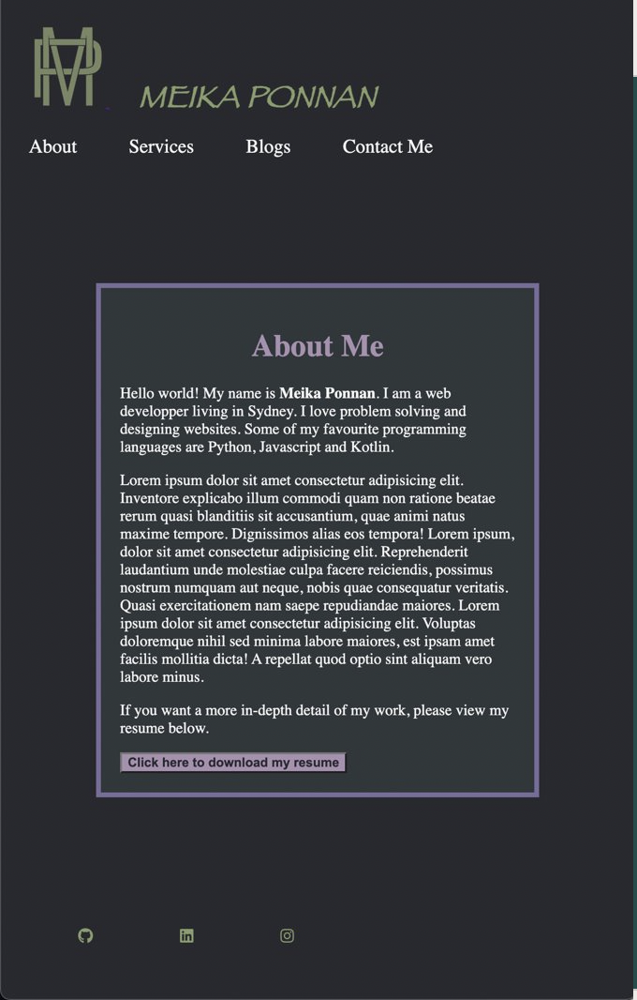
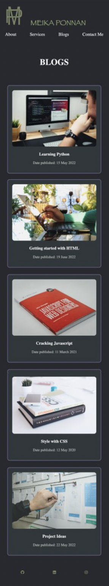
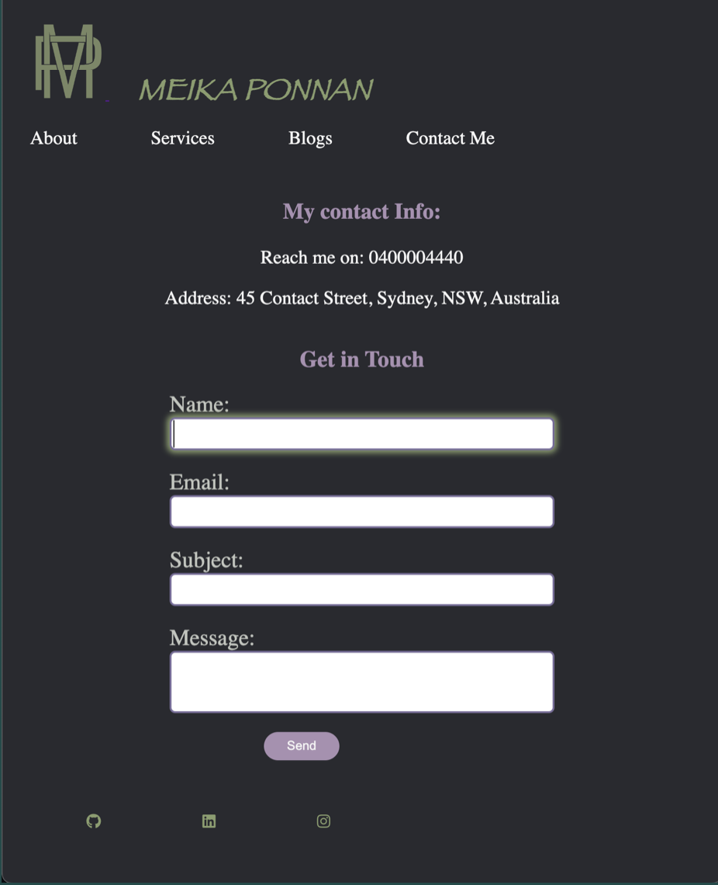

# Meika Ponnan - Portfolio

## Links
Below are the links to my: 

Website:

https://meikaponnancoderportfolio.netlify.app/

GitHub Repo:

https://github.com/MeikaPonnan/MeikaPonnan_T1A2

Presentation:


## Overview
The purpose of my portfolio website is to showcase my ability with html and css, as well as my personaliy and creativity. I wanted to use a range of HTML and CSS components that i had learned to make my website interactive and easy to use.

Here are some of the funtionalities/features found on my website:

### 1. Header
The header has a navigation bar that helps you navigate the different pages found on the website. It contains a logo and name that links to other parts of the page(About page, Services page, Blogs page, Contact page). 

Below is the a preview of the header.

html:

```html
 <header>
        <nav>
        <div class="logo-name">
            <a href="../index.html">
                
            </a> 
            <a href="../pages/about.html" class="name">MEIKA PONNAN</a>
        </div>
        </nav>
        <nav class="nav-items">
            <a href="./about.html">About</a>
            <a href="./services.html">Services</a>
            <a href="./blogs.html">Blogs</a>
            <a href="./contact.html">Contact Me</a>
        </nav>
    </header>
```

css:

In css, i set a background color and some padding to the header. I set the size of the logo. I added a color, font size, made the font bold and set the position of the name. I used flex display for the navigation items so that there's space between each of them and made sure it works for each screen size.
```css

header {

    background-color: $primary-background;
    padding: 30px;

        .logo-name {
            margin-bottom: 10px;
               
              

            #logo {
                width: 80px;
            } 

            .name {
                font-size: 2rem;
                color: $primary-color;
                padding: 10px;
                margin: 20px;
                text-decoration: none;
                font-family: fantasy;
                font-weight: bold;
                position: relative;
                
            } 
        }

    .nav-items {
        display: flex;
        flex-wrap: wrap;
        justify-content: space-between; 
        font-size: 20px;
        position: relative;
        

        a {
            text-decoration: none;
            color: $secondary-color;
            
        }
    }
}

@media screen and (min-width: $medium) {
    header {
        

        .logo-name {
            margin-top: 0px;
        }
        
    
        #logo:hover {
            transform: rotate(10deg);
        }
   
        .name {
            font-size: 600%;
            text-decoration: none;
            font-style: italic; 
           
        }

        .name:hover {
            color: $secondary-color;
        }
   
       .nav-items {
            width: 70%;
            position: relative;

            #about:hover {
                transform: rotate(5deg);
                color: $tertiary-color;
                text-decoration-line: overline;
            
            }
            #services:hover {
                transform: rotate(-5deg);
                color: $tertiary-color;
                text-decoration-line: underline;

            }
            #blogs:hover{
                transform: rotate(5deg);
                color: $tertiary-color;
                text-decoration-line: overline;
            }

            #contactme:hover {
                transform: rotate(-5deg);
                color: $tertiary-color;
                text-decoration-line: underline;
            }
        }
       
    }      
}   

@media screen and (min-width: $large) {

    header {

        .nav-items {
            width: 50%;

        }
    }
    
}
```

### 2. Footer
The Footer contains links to my social media where you get to know me and see my work. There's an icon that links to Github, LinkedIn, and Instagram. It also contains a form where the user can input their email address to subcribe to a newsletter.

```html
<footer>
        <h4>Connect With Me</h4>
        <div class="newsletter">
            <form>
                <input type="email" name="email" id="email" placeholder="Enter your Email">
                <input type="submit" name="Submit" value="Submit">
            </form>
        </div>
        <div class="social-media">
            <a href="https://github.com/MeikaPonnan" target="_blank"><i class="fa-brands fa-github"></i></a>
            <a href="https://www.linkedin.com/in/meikaponnan/" target="_blank"><i class="fa-brands fa-linkedin"></i></a>
            <a href="https://instagram.com" target="_blank"><i class="fa-brands fa-instagram"></i></a>
        </div>
    </footer>
```

css:
I've set the background colour and text colour of the footer. The newsletter input field has a border colour that increased in size when the input field is clicked. The submit button changes background color and text color when the cursor is on top of it. Depending on whether the website is viewed on Desktop, tablet or mobile, the social medial links is moved around using display flex property.
```css

footer {

    background-color: $primary-background;
    padding: 16px;
    text-align: center;
    color: $secondary-color;
    
    .newsletter {

        padding: 20px;
        margin: 10px;

        #email {
            border: 2px solid greenyellow;
            border-radius: 5px;

            &:focus {
                outline: none;
                border: 4px solid greenyellow;
            }
        }
        #submit {
            color: $secondary-color;
            background-color: $secondary-background;
            border-radius: 10px;

            &:hover {
                background-color: greenyellow;
                color: $primary-background;
            }
        }

    }
    .social-media {
        display: flex;
        justify-content: space-around;
        padding: 20px;
      

        margin-bottom: 20px;
        
        a {
            i {
                color: $primary-color;
            }
        }
    }
}

@media screen and (min-width: $medium) {
    footer {
        .social-media {
            width: 50%;
        }
    }
    
}


@media screen and (min-width: $large) {
    footer {
        .social-media {
            width: 25%;
            margin-left: auto;

            
        }
    }
    .newsletter form {
        max-width: 100%;
        position: relative;
        padding: 10px;
    }
    
}


```
### 3. About Page:

The About page has a brief summary on me and also includes a button to a link of a pdf copy of my resume. The biggest heading size is used for the 'About me' title. and some paragraphs to make the content more readable. The PDF copy of the resume opens up on another page.


```html
 <main>
            <div class="heading">
                <h1>About Me</h1>
            </div>
            <div class="description">
                <p>Hello world! My name is <b>Meika Ponnan</b>. I am a web developper living in Sydney. I love problem solving and designing websites. Some of my favourite programming languages are Python, Javascript and Kotlin.</p>
                <p>Lorem ipsum </p>
                <p>If you want a more in-depth detail of my work, please view my resume below.</p>
                <a href="../documents/resumedoc.pdf" target="_blank"><button id="download">Click here to download my resume</button></a>
            </div>
        </main>
```
css:
A border is used to encase the content of the about me section and the width of it is auto adjusted to the screen size. The download button increases in size and changes colour when the cursor is on top of it.

```css
main {
    border: 5px solid $border-color;
    padding: 20px;
    margin: 100px;
    width: 50%;
    background-color: $secondary-background;
    color: $secondary-color;
    
    
    .heading {
        text-align: center;
        color: $another-color;
    }

    #download {
        background-color: $another-color;
        color: $primary-background;
        font-weight: bold;
    }
}

@media screen and (min-width: $medium) {

    main {
        width: auto;

        .heading {
            color: rgb(169, 144, 177);
        }

        #download {

            &:hover {
                transform: scale(1.1);
                background-color: $primary-color;
                color:black;   
            }
        }
    }
    
}

```
### 4. Services page
This page contains some of the services i provide. It has 3 articles with headings and different images for each article. 

```html
<main>
        <div class="headingh1">
        <h1>Services</h1>
        </div>
 
        <article>
            <section>
                
            </section>
            <section>
                <h3>Web Development</h3>
            </section>
        </article>
        

        <article>
            <section>
                
            </section>
            <section>
                <h3>Web Designing</h3>
            </section>
        </article> 
        
        <article>
            <section>
                
            </section>
            <section>
                <h3>Mobile App Development</h3>
            </section>
        </article>
        
    </main>
```
css:
Display flex is used to adjust the orientation of the articles for different devices(desktop, tablet and mobile). The text is centered and given a background and text colour. Each article scales up in size and slightly changes colour when the cursor is on it.
```css
main {
    h1 {
        text-align: center;
        color: $secondary-color;
        text-transform: uppercase;

    }
 

    article {
        border: 2px solid $border-color;
        color: $secondary-color;
        border-radius: 10px;
        overflow: hidden;
        margin: 30px 50px;
        background-color: #31373c;
        padding: 20px;
        text-align: center;
        display: flex;
        justify-content: center;
        flex-direction: column;


        section {
            .services1-img{
                width: 100%;
                border-radius: 10px;
            }

            .services2-img{
                width: 100%;
                border-radius: 10px;
            }

            .services3-img{
                width: 100%;
                border-radius: 10px;
            }
        }
    }
}

@media screen and (min-width: $medium) {
    main {
        width: 80%;
        padding: 0px;
        margin: 100px;
    }

}

@media screen and (min-width: $large) {
    main {
        display: flex;
        justify-content: flex-start;
        flex-direction: row;


        .headingh1{
            display: flex;
            align-self: center;
        }


        article {

            &:hover {
                transform: scale(1.2);
                color: $tertiary-color;
            }
        }
    }  
}
``` 

### 5. Blogs Page
The blog page contains a list of blogs i created. They all link to a blog content page where it will direct you to the specific part of the page. It contains articles, sections, headings, paragraphs, divs, images and links.

```html
 <main>
        <div class="heading">
            <h2>Blogs</h2>
        </div>
        <article>

            <section>
                <a href="./blogcontent.html#blogcontent1" target="_blank">
                
                </a>
                <a href="./blogcontent.html#blogcontent1" target="_blank"><h3>Learning Python</h3></a>
                <p>Date published: 15 May 2022</p>
            </section>

        </article>

        <article>

            <section>
                <a href="./blogcontent.html#blogcontent2" target="_blank">
                
                </a>
                <a href="./blogcontent.html#blogcontent2" target="_blank"><h3>Getting started with HTML</h3></a>
                <p>Date published: 19 June 2022</p>
            </section>

        </article> 
        
        <article>

            <section>
                <a href="./blogcontent.html#blogcontent3" target="_blank">
                    
                </a>
                <a href="./blogcontent.html#blogcontent3" target="_blank"><h3>Cracking Javascript</h3></a>
                <p>Date published: 11 March 2021</p>
            </section>

        </article>

        <article>

            <section>
                <a href="./blogcontent.html#blogcontent4" target="_blank">
                
                </a>
                <a href="./blogcontent.html#blogcontent4" target="_blank"><h3>Style with CSS</h3></a>
                <p>Date published: 12 May 2020</p>
            </section>

        </article> 

        <article>

            <section>
                <a href="./blogcontent.html#blogcontent5" target="_blank">
                
                </a>
                <a href="./blogcontent.html#blogcontent5" target="_blank"><h3>Project Ideas</h3></a>
                <p>Date published: 22 May 2022</p>
            </section>

        </article> 
    </main>
```

css:
The blog page uses flexbox to display the articles in either rows or columns depending on the device used/screen size. Each article is enclosed by a border and scales up in size and changes background colour when the cursor is on top of it.

```css 
main {


    .heading { 
        color: $secondary-color;
        font-size: 25px;
        padding: 20px;
        margin: 10px;

        h2 { 
            text-align: center;
            text-transform: uppercase;
        }
    
    }
    

    a {
        text-decoration: none;
        color: $secondary-color;
        
    }

    article {
        border: 2px solid $border-color;
        color: $tertiary-color;
        border-radius: 10px;
        overflow: hidden;
        margin: 30px 40px;
        background-color: $secondary-background;
        padding: 20px;
        text-align: center;

        section {
            .blog1-img{
                width: 100%;
                border-radius: 10px;
            }

            .blog2-img{
                width: 100%;
                border-radius: 10px;
            }

            .blog3-img{
                width: 100%;
                border-radius: 10px;
            }
            .blog4-img{
                width: 100%;
                border-radius: 10px;
            }
            .blog5-img{
                width: 100%;
                border-radius: 10px;
            }
        }
    }
}

@media screen and (min-width: $medium) {
    main {
        article {

            &:hover {
                background-color: #29323a;
              
            }
        }
     
    }
    
}

@media screen and (min-width: $large) {
    main {
        display: flex;
        flex-direction: row;
        
        .heading {
            display: flex;
            align-self: center;
        }

        article {

            &:hover {
                transform: scale(1.2);
                background-color: #29323a;
              
            }
        }
     
    }
    
}
```

### Blog content Page
All the blogs links to the blog content page and it contains all the contents of the blogs. It contains article, headings, images, paragraphs.

```html
<main>
        <article>
            <h1>Learning Python</h1>
            <div id="blogcontent1">
                
                <h3>What is Python?</h3>
                <p>Lorem ipsum dolor 
                </p>
                <p>Date published: 15 May 2022</p>
            </div>

        </article>

        <article>
            <h1>Getting started with HTML</h1>
            <div id="blogcontent2">
                
    
                <h3>Everything you need to know about HTML</h3>
                <p>Lorem ipsum dolor  
                </p>
                <p>Date published: 19 June 2022</p>
            </div>
        </article> 
        
        <article>
            <h1>Cracking Javascript</h1>
            <div id="blogcontent3">
                
                <h3>What is Javascript?</h3>
                <p>Lorem ipsum dolor 
                </p>
                <p>Date published: 11 March 2021</p>
            </div>
        </article>

        <article>
            <h1>Style with CSS</h1>
            <div id="blogcontent4">
                
                <h3>The in and outs of CSS</h3>
                  
                <p>Lorem ipsum dolor 
                </p>
                <p>Date published: 12 May 2020</p>
            </div>
        </article> 

        <article>
            <h1>Project Ideas</h1>
            <div id="blogcontent5">
                
               
                <h3>Some fun projects for you:</h3>
                   
                <p>Lorem ipsum dolor
                </p>
                <p>Date published: 22 May 2022</p>
            </div>
        </article> 
     
    </main>
```

css:
The blog content page is displayed in a column format using flex display. It is centered around the page with different font size for the headings and paragraphs.

```css
main {
    display: flex;
    justify-content: center;
    flex-direction: column;
    flex-wrap: no-wrap;
  

    article {
        color: $tertiary-color;
        margin: 10px;
        padding: 10px;
        text-align: center;


        h1 {
            color: $primary-color;
            font-size: 50px;
            margin: 20px;
            padding: 20px;
        }

        h3 {
            color: $secondary-color;
            font-size: 25px;
        }

        p {
            font-size: 20px;
            padding: 20px;
            margin: 20px;
            
        }

        #blogcontent1 {
            .blog1-img{
                width: 75%;
                border-radius: 10px;
            }
        }

        #blogcontent2 {
            .blog2-img{
                width: 75%;
                border-radius: 10px;
            }
        }

        #blogcontent3 {

            .blog3-img{
                width: 75%;
                border-radius: 10px;
            }
        }
        #blogcontent4 {

            .blog4-img{
                width: 75%;
                border-radius: 10px;
            }
        }

        #blogcontent5 {

        
            .blog5-img{

                width: 75%;
                border-radius: 10px;
            }

        }
    }
}

@media screen and (min-width: $medium) {
    main {
        display: grid;
        grid-template-columns: 1fr;
        grid-row: 1fr;
     
    }
}
    
```
### Contact Page
The contact page has all my contact information. It contains a form with different inputs that can be filled out and a submit button that changes color and size when the cursor is on top of it.

```html
    <main>
        <div class="contact-info">
            <h3>My contact Info:</h3>
            <p> Reach me on: 0400004440</p>
            <p>Address: 45 Contact Street, Sydney, NSW, Australia</p>
        </div>
    <div>
       <h2>Get in Touch</h2>
       <form>
            <div class="form-elements">
                <label>Name: </label>
                <input class="form-input">
            </div>

            <div class="form-elements">
                <label>Email: </label>
                <input class="form-input">
            </div>

            <div class="form-elements">
                <label>Subject: </label>
                <input class="form-input">
            </div>

            <div class="form-elements">
                <label>Message: </label>
                <textarea rows="2" class="form-input form-message"></textarea>
            </div>

            <div class="button-form">
                <button id="submit">Send</button>
            </div>
        
    </div>
        </form>
    </main>
```
css:
The contact page is displayed in a column format for the mobile and tablet view and centered around the page. The desktop view is displayed in a row format which separate the contact info and form in 2 parts. The border of the form input changes colour once clicked and the send button scales up in size and also changes colour.

```css
main {
    display: flex;
    flex-direction: column;
    align-items: center;

    .contact-info {
        color:$secondary-color;
        text-align: center;
        font-size: 20px;
    }

    h3 {
        color: $another-color;
    }


    h2 {
        color: $another-color;
        text-align: center;
    }

    form {
        margin-bottom: 20px;
        color: $tertiary-color;

        .form-elements {
            display: flex;
            flex-direction: column;
            margin-bottom: 20px;

            label {
                font-size: 24px;
            }

            .form-input {
                border: 2px solid $border-color;
                border-radius: 6px;
                font-size: 24px;
                outline: none;
                font-family: Verdana, Geneva, Tahoma, sans-serif;

                &.form-message {
                    resize: none; 
                }
  
                &:focus {
                    box-shadow: 0 0 6px 3px $primary-color;
                }

            }

        }

        .button-form {
            
            #submit {
                height: 30px;
                min-width: 80px;
                background-color: $another-color;
                color: $secondary-color;
                border-radius: 25px;
                border: $secondary-color;
                outline: $secondary-color;

                &:hover {
                    cursor: pointer;
                    background-color: #61714d;
                    color: $primary-background;
                    transform: scale(1.2);
                }

            }
        }
    }

    
}

@media screen and (min-width: $medium) {
    main {
     
        form {

            .form-elements {
               

                .form-input {
                    width: 400px;
                }
            }
        }
        .button-form {
            margin: 10px 100px;
          
        }
    }
    
}

@media screen and (min-width: $large) {

    main {
        display: flex;
        flex-direction: row;
        justify-content: space-around;
        padding: 30px;
        margin: 2px;
     
        form {

            .form-elements {
               

                .form-input {
                    width: 400px;
                }
            }
        }
        .button-form {
            margin: 10px 100px;
          
        }
    }

}
```

## Sitemap
This is the sitemap i created:

Overview:


Home Page:


About me:


Services:


Blogs:


Blog content:


Contact:


## Wireframe
Home page:


About Me:


Services:


Blogs:


Blog Content:


Contact:


## Screenshots
Here are some screenshots of my website:

### Homepage

Desktop View:

Tablet view:

Mobile View:


### About Me

Desktop View:

Tablet View:

Mobile View:

Features:


### Services

Desktop View:

Tablet View:

Mobile View:

Features:


### Blogs

Desktop View:

Tablet View:

Mobile View:

Features:


### Blog content:


### Contact 

Desktop View:

Tablet View:

Mobile View:

Features:


## Target Audience
This website is aimed at potential employers who's looking for a passionate web developer that displays an array of skills.

## Tech stacks
This is what i used to make my website:
1. HTML
2. CSS
3. GitHub
4. Netlify
5. draw.io
6. Figma

